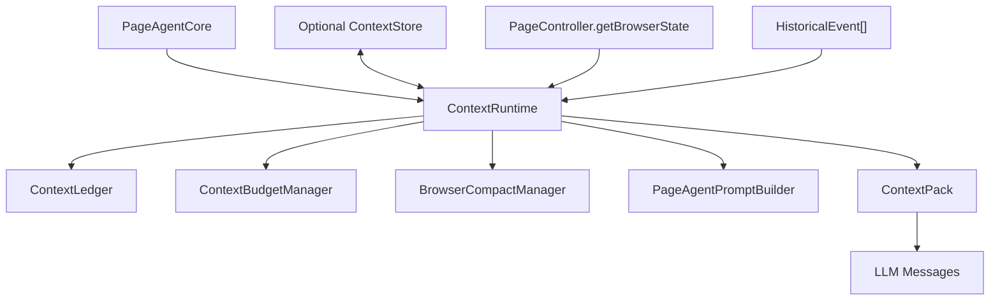

# Page Agent 长时间运行上下文管理设计

## 背景

本设计聚焦一个目标：让 `page-agent-v2` 在长时间、多步骤页面操作中保持稳定的上下文质量，同时不牺牲操作的可控性、性能和正确率。

已有参考文档 `docs/page-agent-context-manager-claude-code-porting-design.zh.md` 给出了更完整的 Claude Code 借鉴方向，包括 Context Pack、compact、resume、知识库、skills、MCP 和可视化。本设计在它的基础上收敛范围，只讨论第一阶段必须落地的上下文管理改造。

关键差异是：Page Agent 不是 Claude Code。Claude Code 可以依赖文件系统、项目文件、shell 和持久化记忆文件；Page Agent 的事实来源是当前浏览器页面、DOM 快照和工具执行结果。Page Agent 不能假设自己能写文件保存上下文，所以需要把上下文管理改成“内存优先、浏览器存储可选、页面事实最高优先级”的架构。

## 目标

1. 支持单个任务长时间运行，历史步骤增长时 prompt 仍保持有界。
2. 保留当前页面可操作状态，不让旧历史污染当前 DOM index。
3. 让旧步骤进入结构化摘要，最近步骤保留原文。
4. 上下文预算可解释，能知道每类内容占多少。
5. 不直接复制 Claude Code 产品源码，按 Page Agent 数据模型重写。
6. 默认不依赖文件系统；Core 可在网页、扩展、测试环境中运行。
7. 所有压缩、裁剪、恢复策略都必须可追踪，不能静默丢失高风险信息。

## 非目标

本阶段不做以下事情：

1. 不改 PageController 的点击、输入、滚动、选择等动作语义。
2. 不把 browser state 摘要化后再执行动作。
3. 不直接实现 skills、MCP Gateway 或长期记忆系统。
4. 不把 session 自动保存到本地文件。
5. 不移除现有 `history` 事件流；UI 和调试仍可依赖它。
6. 不默认扩大高风险操作权限。

## 当前问题

当前上下文主要在 `packages/core/src/PageAgentCore.ts` 中组装：

1. 每步先调用 `pageController.getBrowserState()` 获取当前页面状态。
2. `#assembleUserPrompt()` 拼接 instructions、user request、step info、完整 `history` 和 `browser_state`。
3. 每步执行后把 `AgentStepEvent` 追加到 `this.history`。
4. 同一任务中 `history` 会线性增长，并完整进入下一轮 prompt。
5. 新任务开始时 `execute()` 会清空 `history`。

这对短任务清晰可控，但长任务会有几个问题：

| 问题 | 后果 |
|---|---|
| 历史全量进入 prompt | token、延迟和成本线性增长 |
| 旧动作输出长期保留 | 旧 DOM index 可能误导后续操作 |
| 没有预算报告 | 很难判断慢在哪里、上下文爆在哪里 |
| 没有 compact 边界 | 长任务只能靠 `maxSteps` 截断或失败 |
| `memory` 依赖模型每步自觉维护 | 长任务中容易遗漏关键事实 |
| Core 没有上下文存储抽象 | 浏览器扩展无法安全地 resume 或 checkpoint |

## 设计原则

### 当前页面事实最高优先级

每一轮操作前都必须重新 observe 当前页面。`browser_state` 是唯一可用于选择 DOM index 的事实来源。摘要、历史、知识库和用户补充都不能覆盖当前页面状态。

### DOM index 短生命周期

历史和摘要中可以保留“点击了搜索按钮”“打开了日志弹窗”这类语义事实，但不能保留“继续点击某个旧编号”这类可执行指令。旧 index 只能作为调试记录，不能进入长期 working memory。

### 最近原文，旧的摘要

最近几步保留完整 `evaluation_previous_goal`、`memory`、`next_goal` 和 `action.output`，用于判断刚刚发生了什么。更早步骤进入结构化 compact summary。

### 内存优先，持久化可选

Core 默认只使用内存中的 `ContextRuntime`。扩展端可以通过可选 `ContextStore` 把 checkpoint 写入 `chrome.storage.local`、`chrome.storage.session` 或 IndexedDB，但 Core 不直接依赖浏览器 API，也不依赖文件系统。

### 压缩必须可验证

Compact 结果必须结构化、可显示、可测试。压缩后第一步仍然必须基于当前页面重新 observe。如果 summary 与页面冲突，以页面为准。

## 目标架构



### 模块职责

| 模块 | 位置 | 职责 |
|---|---|---|
| `ContextRuntime` | `packages/core/src/context/ContextRuntime.ts` | 每个任务的上下文运行态入口 |
| `ContextLedger` | `packages/core/src/context/ContextLedger.ts` | 保存 step、observation、compact boundary 和 working memory |
| `ContextBudgetManager` | `packages/core/src/context/tokenBudget.ts` | 估算 section 大小，决定裁剪策略 |
| `BrowserCompactManager` | `packages/core/src/context/BrowserCompactManager.ts` | 把旧历史压缩为浏览器任务 checkpoint |
| `PageAgentPromptBuilder` | `packages/core/src/context/PageAgentPromptBuilder.ts` | 从 Context Pack 渲染 prompt |
| `ContextStore` | `packages/core/src/context/ContextStore.ts` | 可选持久化接口，默认内存实现 |
| `ContinuationResolver` | `packages/core/src/context/ContinuationResolver.ts` | 判断新输入应继承、部分继承还是清空旧上下文 |

## 核心数据结构

### ContextConfig

```ts
interface ContextConfig {
  enabled?: boolean
  maxPromptTokens?: number
  recentStepCount?: number
  compactAfterSteps?: number
  compactAtBudgetRatio?: number
  preserveFailedSteps?: number
  persistence?: 'none' | 'adapter'
}
```

默认值建议：

| 字段 | 默认值 | 说明 |
|---|---:|---|
| `enabled` | `false` | 第一版可通过 feature flag 打开 |
| `maxPromptTokens` | `32000` | 只用于预算估算，不承诺精确 token |
| `recentStepCount` | `6` | 最近 6 步原文保留 |
| `compactAfterSteps` | `12` | 12 步后允许 compact |
| `compactAtBudgetRatio` | `0.7` | 估算超过预算 70% 触发 compact |
| `preserveFailedSteps` | `3` | 最近失败步骤额外保护 |

### ContextPack

```ts
interface ContextPack {
  instructions: ContextSection[]
  agentState: ContextSection
  sessionSummary?: ContextSection
  protectedFacts: ContextSection
  recentSteps: ContextSection
  currentPage: ContextSection
  safetyRules: ContextSection
  budgetReport: ContextBudgetReport
}
```

`currentPage` 必须最后基于最新 `BrowserState` 构建，不能从 summary 或 store 中恢复。

### BrowserSessionSummary

```ts
interface BrowserSessionSummary {
  userGoal: string
  currentSubGoal: string
  completed: string[]
  failedAttempts: string[]
  stableFacts: string[]
  businessObjects: BusinessObjectRef[]
  userDecisions: string[]
  riskDecisions: string[]
  currentPageSemanticState: {
    url: string
    title: string
    semanticLocation: string
    visibleEvidence: string[]
  }
  doNotRepeat: string[]
  nextRecommendedActions: string[]
}
```

```ts
interface BusinessObjectRef {
  type: string
  name?: string
  id?: string
  aliases?: string[]
  evidence: string[]
}
```

禁止写入 summary：

1. DOM index。
2. 过期 CSS selector。
3. 密码、token、cookie、完整个人隐私。
4. 未验证猜测。
5. “一定成功”这类无法追踪的结论。

### ContextStore

```ts
interface ContextStore {
  load(taskId: string): Promise<StoredContext | undefined>
  save(taskId: string, context: StoredContext): Promise<void>
  clear(taskId: string): Promise<void>
}
```

Core 默认提供 `InMemoryContextStore`。扩展端后续可以提供 `ChromeContextStore`：

| 环境 | Store | 说明 |
|---|---|---|
| page-agent npm/browser demo | 内存 | 任务结束即丢弃 |
| Chrome extension sidepanel | `chrome.storage.session` 或内存 | 适合 sidepanel 临时恢复 |
| Chrome extension 长会话 | IndexedDB 或 `chrome.storage.local` | 适合 checkpoint 和崩溃恢复 |
| 测试环境 | fake store | 方便断言 compact/resume |

持久化只保存 summary、recent events、budget report 和必要 metadata，不保存可复用 DOM index。

## Prompt 组装策略

新的 prompt 不再把完整 `history` 直接塞入 `<agent_history>`，而是分区渲染：

```xml
<agent_state>
  <user_request>...</user_request>
  <step_info>...</step_info>
  <context_rules>
    Current browser state is the source of truth.
    Element indexes from history or summary are stale and must not be reused.
  </context_rules>
</agent_state>

<session_summary>
  ...
</session_summary>

<protected_facts>
  ...
</protected_facts>

<recent_steps>
  ...
</recent_steps>

<browser_state>
  ...
</browser_state>
```

保留当前系统提示中的浏览器规则，但新增两条上下文规则：

1. 历史和 summary 只能用于理解任务进度，不能提供可执行 DOM index。
2. 如果 summary 和当前 `browser_state` 冲突，必须以当前 `browser_state` 为准，并在 `evaluation_previous_goal` 中说明不一致。

## Compact 触发策略

满足任一条件时允许 compact：

1. step 数超过 `compactAfterSteps`。
2. prompt 估算超过 `maxPromptTokens * compactAtBudgetRatio`。
3. 最近发生明显阶段切换，例如 URL 改变、打开详情页、进入弹窗、完成一个子目标。
4. `history` 中连续失败或等待导致上下文膨胀。

第一版不需要每次触发都调用额外 LLM。建议分两级：

| 级别 | 做法 | 适用场景 |
|---|---|---|
| deterministic compact | 从历史事件中提取 action、failed output、navigation observation | 默认路径，性能稳定 |
| LLM compact | 用小 prompt 生成结构化 summary，并用 schema 校验 | 历史复杂、需要语义归纳时 |

为了性能，自动 compact 默认先走 deterministic compact；只有超预算或摘要质量不足时再调用 LLM compact。

## 上下文预算

第一版使用字符估算，不依赖模型专属 count tokens API。保守估算可用：

```ts
estimatedTokens = Math.ceil(text.length / 3)
```

预算建议：

| Section | 默认比例 | 处理策略 |
|---|---:|---|
| System prompt | 10% | 固定，不动态膨胀 |
| Agent state | 8% | 用户目标和 step info 必保留 |
| Session summary | 12% | 超长时结构化裁剪 |
| Protected facts | 8% | 用户决定、风险、失败禁忌必保留 |
| Recent steps | 20% | 保留最近 N 步，失败步骤优先 |
| Current page | 40% | 最高优先级，必要时裁剪页面文本但保留 index |
| Debug report | 2% | 只在 debug 开启时注入 |

如果总预算不足，裁剪顺序为：

1. Debug report。
2. 低优先级旧 observation。
3. recent steps 中已进入 summary 的成功步骤。
4. session summary 中冗长解释。
5. current page 中非交互长文本。

不能裁剪：

1. 用户原始任务。
2. 当前 `browser_state` 中的可交互元素 index 和标签。
3. 最近失败动作。
4. 用户明确确认或拒绝的高风险决定。
5. `done` 前所需的输出格式要求。

## 长时间运行的内存模型

Page Agent 不写文件，因此长时间运行分两种能力：

### 单任务长运行

单次 `execute()` 内，`ContextRuntime` 在内存中维护：

1. 当前 compact summary。
2. 最近 N 步原文。
3. protected facts。
4. budget report。
5. compact boundaries。

`this.history` 仍作为完整事件流存在，用于 UI 和调试。Prompt 只消费 `ContextPack`，不再消费完整 `history`。

### 可选恢复

如果运行在扩展中，可以通过 `ContextStore` 保存 checkpoint：

1. sidepanel 关闭前保存 latest summary。
2. heartbeat 检测到 Agent 仍在运行时保存轻量 checkpoint。
3. 用户选择继续会话时加载 summary 和 recent events。
4. resume 后第一步必须重新 observe 当前页面。

恢复时不自动执行上一次未完成的点击、提交、删除、重启等动作。高风险操作必须重新确认。

## 接续判定策略

浏览器页面会变化，所以不能只用“是不是同一个会话”来决定是否继承上下文。每次用户新输入都应经过 `ContinuationResolver` 判断，输出一个明确的接续模式。

判定维度：

| 维度 | 判断内容 | 主要来源 |
|---|---|---|
| 任务连续性 | 用户是否还在推进原任务，还是提出了新问题 | 原始任务、用户新输入、pending question |
| 业务对象连续性 | 是否仍围绕同一个实例、订单、故障、日志、告警等对象 | `businessObjects`、当前页面文本、URL/title |
| 页面可接续性 | 当前页面是否还能支持原任务下一步 | 最新 `browser_state`、URL/title、页面语义位置 |
| 风险状态 | 是否涉及提交、删除、重启、恢复、扩容等高风险动作 | protected facts、action history、用户确认 |

### ContinuationDecision

```ts
type ContinuationMode =
  | 'continue_original_task'
  | 'new_task_same_page'
  | 'same_business_new_page'
  | 'fresh_task'
  | 'ask_user_to_confirm'

type ContextSectionKey =
  | 'task'
  | 'sessionSummary'
  | 'protectedFacts'
  | 'recentSteps'
  | 'businessObjects'
  | 'currentPage'
  | 'instructions'

interface ContinuationDecision {
  mode: ContinuationMode
  reason: string
  inheritedSections: ContextSectionKey[]
  discardedSections: ContextSectionKey[]
  requiresFreshObserve: boolean
  requiresUserConfirmation: boolean
}
```

### 判定矩阵

| 场景 | 决策 | 继承内容 | 丢弃内容 |
|---|---|---|---|
| 用户只是回答 Agent 刚才的问题 | `continue_original_task` | 原任务、summary、recent steps、protected facts、业务对象 | 无，但仍重新 observe |
| 用户还在同页面，但问了另一个问题 | `new_task_same_page` | 当前 `browser_state`、页面 URL/title、必要系统规则 | 原任务 summary、recent steps、旧 subgoal |
| 用户换了页面，但还在问同一个实例或同一个故障 | `same_business_new_page` | 业务对象、稳定事实、用户决定、风险决定 | 旧页面 recent steps、旧 DOM/page-specific facts |
| 用户换了页面，也换了问题 | `fresh_task` | 只保留当前页面状态和全局系统规则 | 旧 summary、recent steps、业务对象、旧风险上下文 |
| 信号冲突或涉及高风险恢复 | `ask_user_to_confirm` | 暂不自动继承，等待用户确认 | 暂不执行下一步动作 |

### 判定信号

`ContinuationResolver` 应先使用确定性信号，只有不确定时才调用 LLM 分类，避免每次用户输入都增加延迟。

确定性信号：

1. 如果存在未完成的 `ask_user` pending question，且用户输入像回答而不是新指令，直接判定为 `continue_original_task`。
2. 如果 URL/title/page signature 基本一致，但用户输入任务意图明显不同，判定为 `new_task_same_page`。
3. 如果当前页面或用户输入命中旧 `businessObjects` 的 id/name/alias，但 URL/title 已变化，判定为 `same_business_new_page`。
4. 如果任务意图和业务对象都不匹配，判定为 `fresh_task`。
5. 如果要继承的上下文包含高风险未完成动作，判定为 `ask_user_to_confirm`。

LLM 分类只接收小上下文：

1. 旧任务目标。
2. 用户新输入。
3. 旧 `businessObjects`。
4. 当前 URL/title 和少量页面语义摘要。
5. 最近 pending question。

LLM 分类结果必须落到 `ContinuationDecision` schema，不能直接生成新 prompt。

### 不同模式的上下文继承规则

`continue_original_task`：

1. 保留 session summary、recent steps、protected facts。
2. 把用户回答写入 observation。
3. 第一轮仍使用最新 `browser_state`。

`new_task_same_page`：

1. 开新 task id 或 task epoch。
2. 不继承旧 summary 和 recent steps。
3. 只把当前页面状态作为新任务起点。
4. 可保留全局 instructions 和当前页面 page instructions。

`same_business_new_page`：

1. 继承业务对象、稳定事实、用户明确决定和风险决定。
2. 不继承旧页面上的 DOM index、旧 recent steps、旧页面位置结论。
3. Prompt 中说明“业务对象相同，但页面已变化，必须重新观察当前页面”。

`fresh_task`：

1. 清空旧 context runtime。
2. 保留当前页面 observe 结果。
3. 不注入旧 summary、旧 business objects 或 old recent steps。

`ask_user_to_confirm`：

1. 不执行页面动作。
2. 用 `ask_user` 或 sidepanel 提示用户选择是否接着旧任务。
3. 用户确认后再转换成其他确定模式。

## 可控性保障

1. 旧 index 不进入 summary，也不进入 protected facts。
2. Prompt 明确规定只能使用当前 `browser_state` 中出现的 index。
3. Compact 后写入 `compact_boundary` event，UI 和测试都能看到。
4. 高风险用户决定进入 protected facts，不被裁剪。
5. 如果页面 URL/title 与 summary 不一致，summary 降权，必要时要求用户确认。
6. `maxSteps` 仍然保留；长时间运行靠上下文有界，不靠无限循环。
7. 连续失败、连续等待、重复动作应该进入 `doNotRepeat`。
8. 新用户输入必须经过 `ContinuationResolver`，不能因为 sidepanel 仍在同一会话就默认继承全部上下文。

## 性能保障

1. Prompt 长度有预算上限，历史不会线性进入 LLM。
2. 默认 deterministic compact，避免频繁额外 LLM 调用。
3. 当前页面仍每步 observe，但上下文构建只处理必要 section。
4. `ContextBudgetReport` 记录每个 section 的估算 token，便于定位性能问题。
5. Store 保存 checkpoint 时只写轻量 summary，不写完整 raw request/response。
6. Compact 触发要有冷却机制，例如两次 compact 至少间隔 4 步，避免抖动。

## 正确率保障

1. 当前页面事实优先，summary 只辅助理解进度。
2. 最近失败步骤原文保留，避免重复失败。
3. Protected facts 保存用户要求、输出格式、高风险确认和明确否定。
4. Compact summary 使用结构化 schema，并做字段校验。
5. Compact 后第一步仍基于最新 `browser_state` 决策。
6. 如果 compact 失败或 schema 不合法，回退到“最近 N 步 + deterministic summary”。
7. 所有摘要只保存已验证事实，猜测必须标记为 uncertain 或不写入。

## 集成方式

### PageAgentCore

`PageAgentCore` 增加可选配置：

```ts
interface AgentConfig {
  context?: ContextConfig
  contextStore?: ContextStore
}
```

执行流程调整为：

1. `execute()` 创建 `ContextRuntime`。
2. 每步 observe 后，把 `task`、`history`、`browserState`、`instructions` 传给 `ContextRuntime.buildPack()`。
3. `PageAgentPromptBuilder` 渲染 user prompt。
4. 工具执行后，把新的 `AgentStepEvent` 交给 `ContextRuntime.recordStep()`。
5. 如果达到 compact 条件，`ContextRuntime.compact()` 更新 summary。

### UI 和扩展

第一阶段不要求新增复杂 UI，但建议把 budget report 暴露给调试：

1. `AgentStepEvent` 或新事件中带 `contextBudgetReport`。
2. sidepanel 可以后续显示当前 prompt 预算、summary 和 compact 次数。
3. `useAgent` 的 `carryHistory` 保持兼容，但真正上下文恢复应走 `resumeContext`。
4. 用户补充输入进入 Agent 前，先调用 `ContinuationResolver` 决定接续模式。

## 分阶段实施

### Phase 1：PromptBuilder 抽离，行为不变

目标：

1. 把 `#assembleUserPrompt()` 的字符串拼接移到 `PageAgentPromptBuilder`。
2. 输出与当前实现尽量一致。
3. 添加单元测试锁定 prompt 结构。

验收：

1. 现有短任务行为不变。
2. `npm run typecheck` 通过。
3. Prompt snapshot 测试通过。

### Phase 2：ContextPack 和预算报告

目标：

1. 新增 `ContextPack`。
2. 仍保留完整 history 注入，但能生成 budget report。
3. 通过 feature flag 打开。

验收：

1. 每步能看到各 section 估算 token。
2. 未启用 compact 时，prompt 与旧行为兼容。

### Phase 3：Recent steps + summary

目标：

1. 最近 N 步原文保留。
2. 更早步骤进入 deterministic summary。
3. 失败步骤和用户决定进入 protected facts。

验收：

1. 30 步以上任务 prompt 不线性增长。
2. Summary 不包含 DOM index。
3. 最近失败动作仍在 prompt 中可见。

### Phase 4：结构化 compact

目标：

1. 引入 `BrowserCompactManager`。
2. 支持 deterministic compact 和可选 LLM compact。
3. Compact boundary 可记录、可显示。

验收：

1. Compact 后任务能继续。
2. Compact 输出 schema 校验失败时可回退。
3. 当前页面与 summary 冲突时，模型被明确要求以页面为准。

### Phase 5：可选 ContextStore

目标：

1. Core 提供 `ContextStore` 接口和内存实现。
2. 扩展端可接入 `chrome.storage` 或 IndexedDB。
3. Resume 使用 `ContinuationDecision` 决定继承 summary、recent events、业务对象还是只使用当前 observe。

验收：

1. 无 store 时 npm/browser demo 正常运行。
2. 有 store 时可保存和加载 checkpoint。
3. Resume 不包含旧 DOM index。
4. 同会话新问题不会错误继承旧任务 summary。

## 测试策略

### 单元测试

1. PromptBuilder 渲染顺序。
2. Budget 估算和裁剪顺序。
3. Deterministic compact 不输出 DOM index。
4. Protected facts 不被裁剪。
5. Recent steps 保留最近 N 步。
6. Compact schema 校验和 fallback。
7. ContinuationResolver 的五种模式判定。

### 集成测试

1. 构造 50 步历史，验证 prompt 长度有界。
2. 构造旧步骤包含 `[12]`，验证 summary 不含可执行 index。
3. 构造失败动作，验证失败信息进入 recent/protected。
4. 构造 URL 变化 observation，验证 summary 记录语义位置。
5. 构造 context disabled，验证旧行为兼容。
6. 构造“同页面新问题”，验证只继承当前页面信息。
7. 构造“换页但同业务对象”，验证继承业务事实但丢弃旧页面 steps。

### 回归测试

1. 简单点击任务。
2. 表单输入任务。
3. 滚动查找任务。
4. 多步导航任务。
5. ask_user 中断后继续任务。

## 风险与缓解

| 风险 | 缓解 |
|---|---|
| Compact 丢失关键事实 | protected facts + recent steps + schema 校验 |
| Summary 误导页面操作 | 当前 browser state 最高优先级，旧 index 禁止入摘要 |
| 额外 compact 降低性能 | 默认 deterministic compact，LLM compact 只在必要时触发 |
| 长任务内存持续增长 | Prompt 有界，raw history 后续可增加 debug retention policy |
| Resume 执行旧危险动作 | resume 后重新 observe，高风险操作重新确认 |
| Feature 改动影响短任务 | `context.enabled=false` 默认兼容，分阶段打开 |

## 推荐结论

推荐先做“上下文有界化”，而不是一次性移植 Claude Code 风格的完整 session/memory/skills 系统。

第一版最小可行设计是：

1. 抽出 `PageAgentPromptBuilder`。
2. 引入 `ContextPack` 和 `ContextBudgetReport`。
3. 保留最近 6 步原文。
4. 把更早步骤压缩成不含 DOM index 的 `BrowserSessionSummary`。
5. 用 feature flag 控制启用。
6. 默认只用内存存储，扩展端后续再接 `ContextStore`。

这样可以让 Page Agent 支持更长任务，同时保持三个核心要求：

1. 可控性：只用当前 browser state 操作，不复用旧 index。
2. 性能：prompt 不随步骤线性增长，compact 默认不额外调用 LLM。
3. 正确率：最近失败、用户决定和当前页面事实始终保留。

## 实施状态

- PromptBuilder: implemented in `packages/core/src/context/PageAgentPromptBuilder.ts`.
- ContextPack and budget report: implemented in `packages/core/src/context/ContextRuntime.ts` and `packages/core/src/context/tokenBudget.ts`.
- Deterministic compact: implemented in `packages/core/src/context/BrowserCompactManager.ts`.
- ContinuationResolver: implemented in `packages/core/src/context/ContinuationResolver.ts`.
- Runtime persistence: optional through `ContextStore`; Core works without browser storage or filesystem access.
